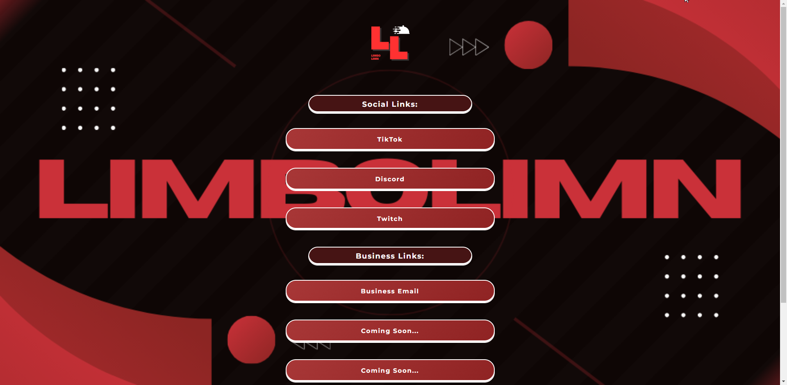

# [Website Name]

This website was created using the [Streamer Website Builder](https://github.com/LiamBMX/Streamer-Website-Builder) repository. 

## About

The Streamer Website Builder is a tool that allows you to build and deploy a personalized website using a simple graphical user interface (GUI). It is designed to make the process of creating a website straightforward, especially for streamers or individuals who want to showcase their social links.



## How to Create Your Own Website

Follow these steps to create your own website using the Streamer Website Builder:

### Prerequisites

Make sure you have Python installed on your system. You can download it from [python.org](https://www.python.org/downloads/).

### Installation

1. **Clone the Repository**

   Open your terminal or command prompt and run the following command:

   \```
   git clone https://github.com/LiamBMX/Streamer-Website-Builder.git
   \```

2. **Navigate to the Project Directory**

   \```
   cd Streamer-Website-Builder
   \```

3. **Run the Application**

   You can either run the Python script directly:

   \```
   python gui.py
   \```

   Or run the batch file if you are on Windows:

   \```
   gui.bat
   \```

4. **Customize Your Website**

   Use the GUI to add, remove, or edit links and other content.

5. **Save Your Changes**

6. **Deploy Your Website**

   Upload the generated files to any web hosting service of your choice.

### Need Help?

For assistance, you can contact Liam on Discord at [@liam0mc](https://discord.gg/jvsAEa6VsA).

## Usage Example

Here are some examples of websites created using the Streamer Website Builder:

- [Liam G Adams' Personal Website](https://liamgadams.com)
- [Friend's Website](https://liambmx.github.io/LilUziTurt/)
- [Another Friend's Website](https://liambmx.github.io/Shzaltht/)


## Contributing

Contributions are welcome! To contribute:

1. Fork the repository: [Fork it](https://github.com/LiamBMX/Streamer-Website-Builder/fork)
2. Create a feature branch: `git checkout -b feature/fooBar`
3. Commit your changes: `git commit -am 'Add some fooBar'`
4. Push to the branch: `git push origin feature/fooBar`
5. Create a new Pull Request

## Roadmap

- [x] Add Changelog
- [ ] Add way to change colors
- [ ] Style GUI better
- [ ] Make website for easier use
- [ ] Multi-language Support
    - [ ] Chinese
    - [ ] Spanish
- [ ] Add a way to add dividers
- [ ] Display email addresses
- [ ] Upload custom icons to buttons

## Donating

Support the project via CashApp: $liamshuffle

## License

Distributed under the MIT license. See `LICENSE` for more information.

For more details, visit the [Streamer Website Builder GitHub page](https://github.com/LiamBMX/Streamer-Website-Builder).
